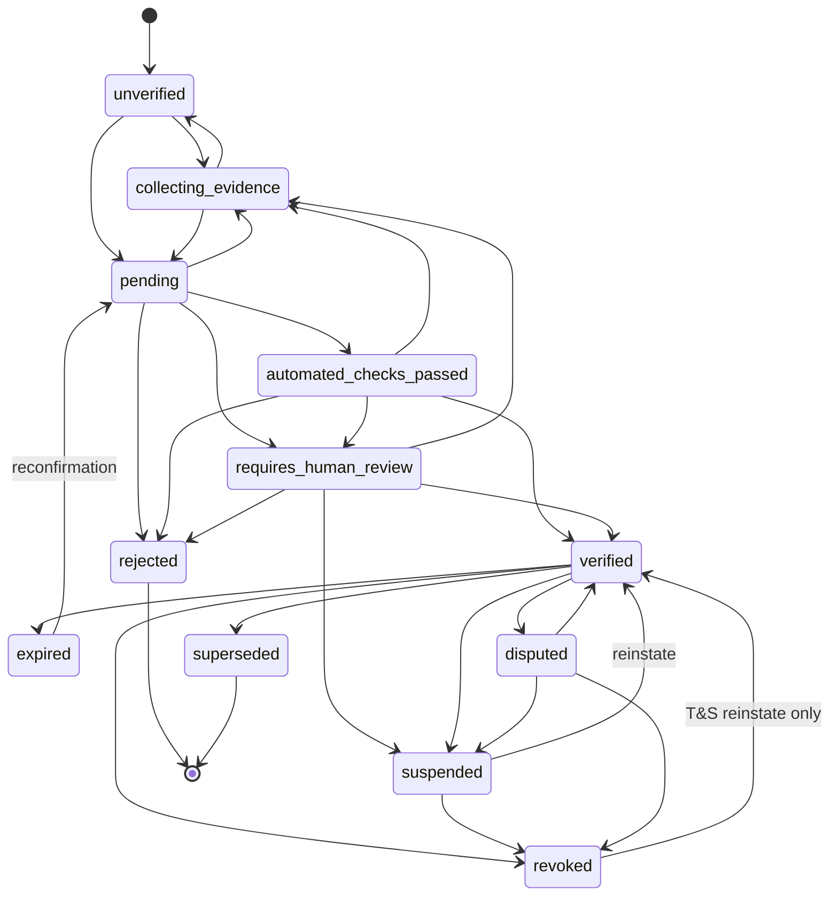

# Milestone 14 — ScoutBox Verification & Trust System

## 1. Philosophy

Verification answers **"What exactly has ScoutBox established, who established
it, using what evidence, and is that claim still valid?"** — never merely "is
this account verified?". There is no account-level boolean, no trust score,
and no AI in any decision path. Uploaded documents are evidence, never truth.
Where no authoritative source exists, the system prepares a complete case and
stops at an explicit human boundary.

**Verification proves facts; authorization decides access.** Nothing in M14
loosens `visibleToOrg`, guardian routing, adult-only representation
(DOB/country `isAdult` — unchanged), the grassroots radius, blocks, or
moderation.

## 2. Trust model

Independent claims (each stands alone): `PERSON_IDENTITY`,
`ORGANISATION_IDENTITY`, `ORGANISATION_DOMAIN`, `ORGANISATION_ADMIN`,
`CLUB_AFFILIATION`, `CLUB_ROLE`, `LICENCE`, `AGENCY_AFFILIATION`,
`AGENCY_ROLE`, `GRASSROOTS_AFFILIATION`, `FEDERATION_AFFILIATION`.

The authority chain:

```
ScoutBox account
  → verified person identity            (evidence → T&S review)
  → verified organisation               (bootstrap → T&S approves first admin)
  → authorised organisation admin       (verification_root_admin, dual control)
  → confirms person ↔ organisation      (organisation_admin_confirmation)
  → confirms role                       (same decision, role correctable)
  → ScoutBox records the verified claim (provenance + audit)
```

Nobody can confirm their own claim (server-enforced at every decision path,
with a security event on attempts).

## 3. Claim model (`db.verClaims`)

`id, subjectType(user|org), subjectId, claimType, organisationId, role,
status, validFrom, validUntil, current, verificationMethod, authorityType,
authorityId, evidenceIds[], createdAt/updatedAt, verifiedAt/verifiedBy,
revokedAt/revokedBy/revocationReason, suspendedAt, disputedAt,
supersedesClaimId, reviewReasons[], riskFlags[], metadata`.

Significant events are additionally written to the **append-only**
`db.verEvents` log (actor, actor org, correlation id, before/after, reason).
Nothing mutates or deletes an event.

## 4. State machine

All transitions validated server-side by one map (`m14/shared.mjs`); no
client can set a status; `document_submitted` can never accompany a
transition into `verified`; `official_domain_email` verifies only
`ORGANISATION_DOMAIN`.



## 5. Effective status (read time)

A badge displays only if — at READ time — the claim is `verified`, not past
`validUntil` (current claims), the organisation is not suspended / revoked /
closed, and no controlling suspension applies. Historical claims (closed
period, `current=false`) stay displayable as history; a **fraud-revoked
organisation stops lending even historical badges**. No cached boolean is
ever trusted; an in-memory claim index keeps list reads O(1) per subject
(plus one batched profiles endpoint for lists).

## 6. Organisation bootstrap (root of trust)

Public application (`/auth/org/verification/apply`) → deterministic checks
(email syntax/alignment, free/disposable classification, domain
normalisation, duplicate org/request/domain detection, evidence completeness,
risk flags; DNS probing honestly `not_configured`) → single-use mailbox code
→ evidence upload → submit → **always `requires_human_review`
(`ROOT_ORGANISATION_BOOTSTRAP`)**. Trust & Safety approves with a written
reason: the organisation identity claim, the legacy `org.verified` flag (same
standing meaning — minors still additionally require the safeguarding
contract), the domain claim (only where the proved mailbox aligns), the
`ORGANISATION_ADMIN` claim and the `verification_root_admin` authority are
established atomically. Once a root admin exists, staff verification is
self-service through the club.

## 7. Human boundary

`decideReview()` is the ONE deterministic engine answering
`CAN_AUTO_COMPLETE` vs `REQUIRES_HUMAN_REVIEW` with exact reason codes
(`ROOT_ORGANISATION_BOOTSTRAP`, `NO_AUTHORITATIVE_SOURCE`,
`CONFLICTING_EVIDENCE`, `IDENTITY_MISMATCH`, `DOMAIN_OWNERSHIP_AMBIGUOUS`,
`DUPLICATE_ORGANISATION`, `HIGH_RISK_ADMIN_CHANGE`,
`DOCUMENT_AUTHENTICITY_UNCONFIRMED`, `REGISTRY_AMBIGUOUS_MATCH`,
`DISPUTED_CLAIM`, `SUSPECTED_FRAUD_SIGNALS`, `MANUAL_EXCEPTION_REQUESTED`).
Humans remain necessary ONLY for: the first administrator of an organisation
without an authoritative source, ambiguous/conflicting evidence, document
authenticity without a register, disputes, suspected fraud, and exceptional
high-risk administrative changes. An organisation-admin confirmation is the
authoritative source for staff claims — those never queue for T&S.

## 8. APIs (following existing router conventions)

- Personal: `/org/verification/me | identity | affiliation | claims/:id/{evidence,submit,dispute} | work-email(/confirm) | licence(/:id/submit) | licence-providers`
- Console: `/org/verification/{dashboard,requests(/:id/decide),staff(/:userId/departed),domains(/:id/confirm,/:id/remove),admins(/:id/revoke),root-transfers/:id/approve,references,player-invites,conflicts,evidence/:id}`
- Public (safe projections only): `/org/verification/public/{user/:id,org/:id,users?ids=}`, `/player|/guardian/verification/org/:id`, `/player/references`, `/guardian/children/:id/references`, invite acceptance `/player/invites/accept`, `/guardian/invites/accept`
- Bootstrap: `/auth/org/verification/apply(/:id/{confirm-email,evidence,submit,status})`
- Trust & Safety: `/admin/verification/{queue,cases/:id(/assign),claims/:id/{approve,reject,request-info,suspend,revoke,reinstate},root-requests/:id/{approve,reject},orgs/:id/{appoint-root,revoke},domain-requests(/:id/decide),disputes(/:id/resolve),authorities/:userId/{claims,flag},evidence/:id}`

## 9. Permissions

`verification_viewer < verification_reviewer < verification_admin <
verification_root_admin` (`db.verAdmins`, server-enforced via
`requireVer()`). Root-level operations additionally require an MFA-enabled
account (existing F12 TOTP). Nobody self-promotes or self-revokes; granting
root authority is a pending transfer needing a SECOND root admin (dual
control, §28); the last root admin cannot be removed by the organisation
itself — Trust & Safety is the recovery path (`appoint-root`).

## 10. Privacy & evidence

Visibility classes on every evidence record: `trust_and_safety` (identity &
licence documents), `organisation_internal` (work-email proof), and
subject-only views. The ONE public projector
(`toPublicVerificationProfile()`) returns only safe display claims — never
document URLs, emails, reviewer notes, risk flags or evidence. Files:
MIME/extension allowlist (no SVG/HTML/executables), 8 MB cap, sanitized
server names (own ids), sha256 hashes (duplicate detection), retrieval only
through authorised, per-read-audited routes (never static paths), and
`malwareScan: 'not_configured'` because no scanner exists — never pretended.
Retention classification (`until_claim_resolution` / `audit_hold` /
`standard`) is stored on every record; **no global scheduled deletion engine
exists in the repository — automated retention enforcement needs that
infrastructure and is documented as a follow-up**. Audit evidence is never
silently deleted.

## 11. Expiry, revocation, disputes

- Deterministic sweep: current verified claims past `validUntil` →
  `expired` (+ T-30d warning notification). Closed historical periods do NOT
  "expire" — they remain verified history.
- Revocation (club action, fraud, org loss, T&S, dispute outcome) propagates
  instantly through the read-time engine; history and provenance stay.
- Departure closes the period (current=false), keeps history, removes
  authority rows, notifies the person — who can dispute. Disputes create a
  case, preserve evidence, flag the claim, notify, and enter the T&S queue;
  they never silently disappear.
- Cascade: `claimsByAuthority` answers "which claims depend on this
  authority?" — flag or selectively suspend after analysis, never blanket
  destruction.

## 12. Licences

Three honest tiers: `document_submitted` → "Credential submitted —
verification pending"; `authoritative_registry` (exact deterministic match)
→ "Licence verified: …"; `scoutbox_manual_review` → "confirmed by Trust &
Safety document review (not an independent register check)". Registry adapter
(`lookupCredential`) with provider states
`configured | not_configured | temporarily_unavailable | unsupported`;
ambiguous → human review; no-match verifies nothing and rejects nothing;
outage → "remains pending". **No production governing-body register is
connected** — only an env-gated local test fixture exercises the adapter.

## 13. References, invitations, conflicts

References require a CURRENT effective verified role, respect
`visibleToOrg`/blocks (no safeguarding bypass), snapshot the coach's
verification provenance at submission ("Coach affiliation was verified when
this reference was submitted." after changes), and correct via versioned
supersession / reasoned withdrawal — never silent edits. Squad invitations:
verified orgs only, single-use purpose-bound tokens, deterministic 20/day
limit, adult self-acceptance, guardian-only acceptance for minors, and no
identity claim is ever created by acceptance. Conflicts of interest are
explicit declarations (family/agent/financial/coaching/other), never
inferred, visible only to org verification admins and T&S.

## 14. Migration (honest)

Orgs already `verified` (a historical T&S decision) → `ORGANISATION_IDENTITY`
claims with method `migration`, provenance noting the legacy origin; their
proved email domains → domain claims. F10 representation credentials →
`LICENCE` claims in `pending` with method `document_submitted` — **no false
upgrades**. The legacy admin toggle stays functional and now writes claim
provenance both ways (`syncLegacyOrgVerification`), so the boolean and the
claim engine cannot drift.

## 15. Observability & audit

`metrics.verification` counters (requests, prechecks passed, human-review
routes, approvals, rejections, disputes, expiries, revocations, email
challenge failures) with no PII labels; queue age in the T&S queue payload;
decisions in the tenant ledger (`verification_decision`) and audit export;
every sensitive evidence read logged as an event.

## 16. Remaining external dependencies / limitations

- No production licence register (FA/UEFA/federation) is connected — adapter
  + local test fixture only.
- No production identity-verification provider; person identity is document
  evidence + T&S review.
- Work-email and domain challenges run over the LOCAL fake delivery
  transport; no production email provider is configured.
- DNS/https domain-ownership probing is `not_configured` (no safe network
  probe from this environment); domain control is proved by mailbox codes.
- No malware scanning (`not_configured` on every evidence record).
- No global scheduled retention engine; classifications + boundaries are in
  place, enforcement infra documented above.
- Root organisation verification intentionally always requires human review.
