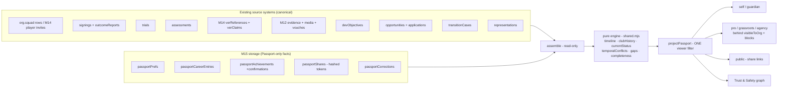

# M15 — The ScoutBox Football Passport

> Every player. One football history. Every important fact shows where it
> came from. The Passport is **what the player says + what coaches confirm +
> what clubs confirm + what ScoutBox systems recorded + what authoritative
> sources verify — clearly distinguished.**

## 1. What the Passport is (and is not)

The Football Passport is the canonical, provenance-aware view of a player's
football career. It is **not** a new datastore, **not** a rating, **not** a
badge, and **not** an endorsement. Every projection carries the sentence:
*"A Football Passport describes evidence and provenance. It is not a rating
of football ability and not a ScoutBox endorsement."*

## 2. Architecture: a projection, never a second copy

`buildFootballPassport(player, viewerKind, opts)` (server-side,
`scoutbox-server/m15/passport.mjs`) assembles one projection per
(player, viewer) from **existing** records. Nothing is stored twice merely
because the Passport displays it. Clients render the server's projection and
never reconstruct history from raw endpoints.

## 3. Source systems

| Passport concern | Canonical source |
|---|---|
| Club relationships | `org.squad` rows, accepted `verPlayerInvites`, `signings` (+`outcomeReports` end dates), self/guardian `passportCareerEntries` |
| Identity | existing `player.identityVerified` → honestly rendered as a ScoutBox document review |
| Trials | `db.trials` (created on acceptance of a trial request) |
| Assessments | `db.assessments` (submitted+ states) |
| References | M14 `verReferences` with their provenance **snapshots** |
| Evidence | M12 `db.evidence` + `player.media` + published vouches |
| Development | `db.devObjectives` (private by default) |
| Applications / transitions / representation | their own M12/M13 stores |

New M15 stores are limited to what the Passport genuinely introduces:
preferences, self-submitted career entries, achievements (+confirmations),
hashed share tokens, and correction requests.

## 4. The provenance vocabulary

Eight values, ranked **only** for display precedence (never rendered as a
score): `player_submitted, guardian_submitted, system_recorded,
historical_migration, scoutbox_reviewed, verified_coach_confirmed,
verified_club_confirmed, authoritative_registry`. Every item carries its
value plus honest plain-language copy, e.g. *"Provided by the player.
ScoutBox has not independently confirmed this item."* M14 verification
methods map deterministically onto this vocabulary
(`provenanceFromMethod`).

## 5. Viewer contexts — one server-side filter

`projectPassport(full, viewer)` is the single filter for `self`,
`guardian`, `pro_club`, `grassroots_club`, `agency`, `other_player`,
`public` and `trust_safety`. There is no "one giant JSON the frontend
hides": each context receives only its fields. Org viewers additionally
pass the **standing gates first** — `visibleToOrg` (agency/minor wall,
grassroots 50 km radius), blocks, verified-club-only minors. The Passport
adds no new access anywhere.

## 6. Timeline engine (§7 taxonomy)

`buildTimeline` derives events (`club_joined`, `club_left`,
`trial_attended`, `trial_outcome`, `assessment_completed`,
`reference_received`, `evidence_added`, `development_objective_*`,
`opportunity_application`, `transition_*`, `signed`,
`role_or_squad_changed`, `representation_*`, `achievement`,
`position_change`) with canonical ids `pev:<sourceType>:<sourceId>:<semantic>`
— deterministic, deduplicated on re-projection, reverse-chronological with a
stable tiebreak. Every event carries provenance, visibility and a source
reference (full source ids for self/guardian/T&S; source *type* only for
org viewers).

## 7. Date-precision honesty

`normWhen` keeps the source precision — `day`, `month` or `year` — and
**never invents** a finer date. "2018" renders as *2018*; a career entry
needs at least a year ("A year is enough — exact dates are never
invented"); unparseable dates are refused, not silently normalised.

## 8. Club history — a trial is never employment

`clubHistory` builds best-evidence career rows from claims/signings/squad
rows/career entries. Trials **never** produce a history row or a
`club_joined` event. A self entry duplicating an authoritative row folds
into it (`foldedConflicts`) instead of rendering twice. A suspended
organisation confers no *current* relationship — at read time, with the
historical facts preserved (same policy as M14 badges).

## 9. Current status and the conflict engine (§57)

Field-level precedence: authoritative registry > verified club > verified
coach > ScoutBox review > guardian > player. When a verified club record
and a player entry disagree about the current club, the authoritative
record **displays**, and the self view shows a `CURRENT_CLUB_CONFLICT`
explaining both sides with a correction path. Player input is never
silently discarded — and never silently wins. Conflict flags are visible to
the player and T&S only; recruiting orgs get the resolved display.

## 10. Temporal consistency (§58)

Impossible chronology (`before_dob`, `far_future`, `left_before_joined`,
`overlapping_current_authoritative`) becomes a `TEMPORAL_CONFLICT` flag —
routed to correction, **never** an automatic fraud accusation.

## 11. Ownership: the player owns the experience, not the records

Bio, positions, coarse availability, career entries, achievements and
public selections are player-editable (guardian-editable for minors).
Club-confirmed events, references and assessments are not — a confirmed
achievement returns `403 CONFIRMED_RECORD` on withdrawal, and the
correction flow (`passportCorrections` → T&S resolution with a written
reason: corrected / rejected / referred) is the only path. Verification
claims additionally keep their existing M14 dispute flow.

## 12. Evidence integration

Evidence stays in M12: the Passport shows **summaries and counts**
("Counts describe evidence coverage, not football ability"), plus
timeline events for footage. No file duplication, no media ids, no signed
URLs anywhere in a Passport payload. Superseded evidence is honoured.

## 13. References & historical truth (§23/§26)

M14 references project with their submission-time provenance snapshot.
While the coach's affiliation is current the copy reads *"Coach's X
affiliation is verified."*; after departure it flips to *"Coach affiliation
was verified when this reference was submitted."* The snapshot is never
rewritten.

## 14. Achievements (§27/§56)

Player/guardian-submitted, honest provenance, forged client-side
provenance is inert (whatever the request body claims, a new achievement is
player/guardian-submitted). A **verified** organisation that can already
see the player may confirm one — upgrading provenance to
`verified_club_confirmed` without rewriting the entry, attributed to the
organisation (individual staff identity is not exposed to the player).

## 15. Completeness: descriptors, gaps, eligibility (no scores)

The versioned gap engine (`GAP_RULES` v1, eight rules) is deterministic
over facts — no AI, no scores. Output is coverage words
(`strong/moderate/limited`), non-shaming suggestions ("A coach reference
would strengthen your passport"), and a search-eligibility preview whose
denominator is exactly the generic rule list — never a club's confidential
criteria. Gaps auto-resolve when their condition turns false.

## 16. Privacy levels — narrowing only (§16/§46)

Item visibility comes from the **source policy** (`public`, `recruitment`,
`private`, `guardian_only`, `trust_and_safety`, plus own-org variants for
trials/assessments). Player `publicSelections` can only opt public-eligible
items *into* the public view; selecting anything else stores harmlessly and
surfaces nothing. Selections narrow; they never widen.

## 17. The public passport (§17/§87)

Public viewers get: name, **age (never DOB)**, position, city-level
location (stripped entirely for minors), honest identity assurance, the
**confirmed** current club only, explicitly selected public-eligible
items, confirmed+selected achievements, and evidence counts. Excluded:
assessments, scout notes/identities, transitions, representation, guardian
details, private evidence, conflict flags, media references.

## 18. Sharing (§18–§20/§50)

Opaque 24-random-byte tokens, stored **only as SHA-256 hashes**, expiring
(1–90 days) and revocable by the owner, the guardian, or T&S. Public links
resolve anonymously to the safe public projection (rate-limited 30/min/IP,
`X-Robots-Tag: noindex`); unknown, revoked, expired and removed-subject
tokens are **indistinguishable 404s**. Recruitment links resolve only
inside an authenticated org session and re-run every standing gate — the
link locates, it never authorises. A QR code is simply the share URL.

## 19. Minors & guardians (§38–§41)

Only the existing DOB+country `isAdult()` decides adulthood — no new age
flags. Guardians hold the child's passport controls (career entries,
achievements, corrections, **all sharing**); a minor calling share routes
gets `403 GUARDIAN_MANAGED`. The agency/minor wall, the verified-clubs-only
minors rule, the grassroots 50 km radius, and blocks all apply unchanged —
tested against direct routes, batch summaries **and** share resolution.

## 20. Performance, audit, honesty

- **Batch**: `GET /org/football-passports?ids=` serves up to 100 light
  summaries (no timelines) in one call — measured **3 ms for 15 seed
  players** in the acceptance suite (<500 ms budget). Invisible players are
  silently absent (concealment by omission).
- **Audit**: recruitment views and share lifecycle events land in the
  existing ledger; players see aggregate counts, never scout identities.
- **Metrics**: `metrics.passport` counters only — no PII.
- **Notifications**: the existing local delivery centre; nothing claims to
  have emailed anyone it didn't.
- **Honest limitations**: identity assurance tops out at ScoutBox document
  review (no authoritative IDV provider is configured, so "Government
  identity verified" never renders); QR rendering is left to the client
  (the URL is the QR payload); share-time snapshot *records* the projection
  version and source ids rather than persisting a full frozen copy;
  FR strings are machine-translated and labelled as such.

## Test coverage

- `scoutbox-server/scripts/m15E2E.mjs` — **184 checks, 71 negative/abuse
  (39 %)**: timeline §81, provenance §82, projection/visibility units, and
  HTTP journeys covering the §79 abuse catalogue (walls, radius, blocks,
  enumeration + rate limit, revocation/removal concealment, narrowing-only
  selections, own-org privacy, suspended orgs, forged viewer/provenance,
  guardian control, batch gating + measured performance).
- `e2e/m15Live.test.mjs` — 21 browser checks, journeys P1–P8 plus the T&S
  correction/share-kill/graph journey, across five separate browser
  contexts against a live backend.
