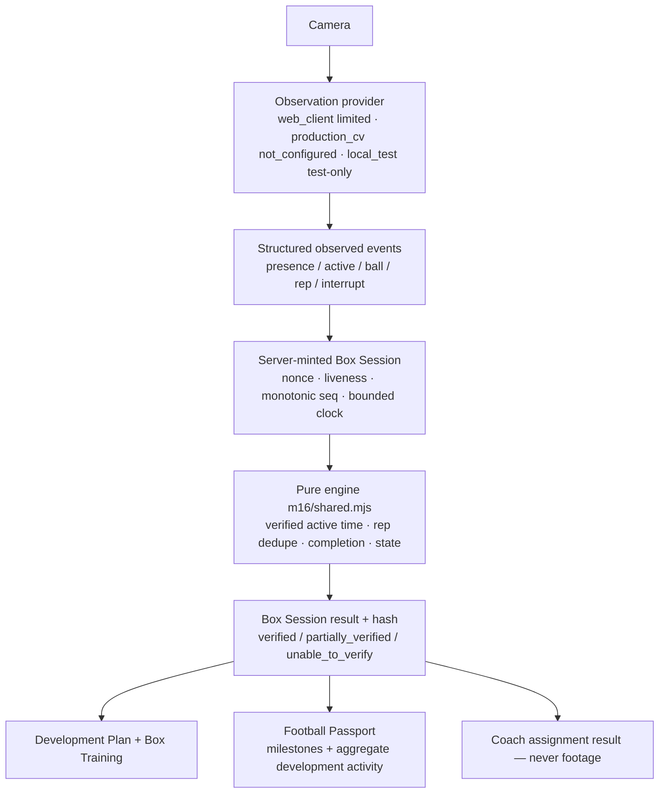

# M16 — Box Cam + Development Intelligence

> **Train. Record. Prove. — Don't just say you trained. Box it.**

## 1. Product philosophy

Box Cam is ScoutBox's **first-party observed-training evidence system**. It
lets a player perform a supported drill while recording live through the
ScoutBox app, and produces a provenance-bearing record of *what ScoutBox
could reliably observe*. It is **not** a generic recorder, a video-upload
feature, an AI coach, a talent rating, a scout replacement, or a
pay-to-be-seen mechanic.

The single strongest truthful statement Box Cam is allowed to make:

> "ScoutBox Box Cam observed activity consistent with this supported drill
> for X active minutes/repetitions during a live capture session."

**Observation ≠ evaluation.** Box Cam never claims a drill was performed
perfectly, that a player improved, or that a player is talented.

## 2. Brand language

Box Cam · Box Cam Verified · Box Cam Evidence · Box Session · Box Training ·
Box Challenge · Box Streak · Train in the Box · Captured by Box Cam · Box
Cam Ready Check. Used naturally in player/coach product copy; admin and
security screens stay factual.

## 3. Truth / verification boundary

`box_cam_observed` is a new provenance value ranked **above**
`player_submitted`/`guardian_submitted` and deliberately **below**
`scoutbox_reviewed`, organisation confirmation and authoritative registries.
It can only be minted by the live session integrity flow — an uploaded
video, a client field, or a T&S actor can never produce it.

## 4. Architecture

Server module `scoutbox-server/m16/`: `shared.mjs` (pure engine),
`drills.mjs` (versioned drill contracts + provider registry), `sessions.mjs`
(session lifecycle + observation ingestion), `training.mjs` (assignments,
challenges, Development Plan, disputes, T&S, prefs), `index.mjs` (stores +
metrics, wired after M15). No raw camera frames or video live in any record.

## 5. Drill framework

Each drill is a versioned detector contract pinning `drillId@drillVersion`
on every session, so a future detector never rewrites history. A drill
declares only the `verificationCapabilities` its detector genuinely has.

## 6. Observation provider

`BoxCamObservationProvider` (prepare / processFrame / finish / capabilities
/ health). Registry statuses are explicit and honest:

| Provider | Status | Verifies |
|---|---|---|
| `production_cv` | **not_configured** | — (no production CV model exists in this environment; stated, never simulated) |
| `web_client` | limited (`web_limited`) | player_presence, active_duration |
| `local_test` | configured, **test-only** (gated by `BOX_CAM_TEST_PROVIDER=1`) | all capabilities — always labelled simulated |

A session verifies only `intersection(drill.capabilities, provider.capabilities)`.

## 7. Live capture

Verified sessions originate only from the live flow: `POST sessions`
(server mints id + fresh nonce + liveness challenge + expiry) → `start`
(nonce + liveness) → `events` (batched observations) → `complete`
(server-derived result). Uploaded media keeps its existing provenance.

## 8. Active-time engine

Verified active time = union of acceptable-quality active intervals,
intersected with the required observation (e.g. the ball) for
ball-required drills, minus pauses / interruptions / multi-person periods,
clamped to the **server-known** session duration. Elapsed session time is
never a substitute. §102 tests cover overlap, nesting, duplicates,
out-of-window, pauses, quality and exact/±1 ms boundaries.

## 9. Repetition engine

Confidence-gated, min-gap deduped, window-bounded, order-independent; two
detectors on the same instant count once. Rep targets return `null` (not a
fabricated count) on drills without the `rep_count` capability — **Box
Wall** ships `rep_count` **not_configured** and says so.

## 10. Verification states

`not_started, setup_required, ready, recording, processing, verified,
partially_verified, unable_to_verify, completed_unverified, cancelled,
invalidated`. A finished session with partial observed work is
`partially_verified` (recorded, never erased); only a total absence of
reliable observation is `unable_to_verify`; missing liveness or an
unavailable provider yields `completed_unverified`.

## 11. Session integrity

Server-owned identity; fresh nonce per session; monotonic per-batch
sequence (non-monotonic rejects the batch); timestamps bounded to the
elapsed window + drift (real providers) or the TTL (the labelled test
provider); duplicate terminal submission and post-completion events
rejected; result hash over the finalized inputs.

## 12. Box Cam Ready Check

Checks only what is measurable (camera permission, live stream, orientation)
and shows "unable to check automatically" for lighting/framing/space/single-
participant. A server-selected liveness challenge establishes **live-session
presence, not identity** — there is no facial recognition anywhere in M16.

## 13. Development Plan

A cohesive view over existing M12 development objectives + Box assignments +
Box Sessions. Completing sessions never auto-marks an objective achieved.

## 14. Coach assignments

Verified, non-suspended, non-agency organisations that already pass
`visibleToOrg` (incl. the agency/minor wall and the grassroots radius) and
blocks may assign supported drills with a target, frequency and optional
instructions, linked to an objective. The assignment snapshots the
assigning person/org and verification state. Coaches receive **results**,
never raw footage. States are non-punitive ("Target not yet completed",
never "failed").

## 15. Box Training

The player hub: Start Box Cam, streak, development activity, assignments,
recent sessions, Box Best, challenges, sharing.

## 16. Box Challenge

ScoutBox and verified-club challenges (drill + metric + window + optional
cap/adult-only). Every challenge carries: *"Completing a Box Challenge does
not mean the club has scouted, selected or endorsed you unless explicitly
stated through a separate ScoutBox recruitment workflow."* Progress is
deterministic and replay-safe; a club challenge never bypasses the standing
visibility rules.

## 17. Box Streak / Box Best

Box Streak counts consecutive **training weeks** with at least one verified
session — rest days never break it, and no unhealthy daily-streak pressure.
Box Best compares only within `drillId@drillVersion`. **No global
leaderboard exists in M16.**

## 18. Passport integration

The Football Passport projects Box Cam data (never copies it): meaningful
session milestones and challenge completions on the timeline (the career
timeline is not flooded), plus an aggregate **Development Activity** summary
that repeats "evidence of recorded training activity … not proof of player
ability." Detailed session history lives in Box Training.

## 19. Privacy

Session detail is SELF/GUARDIAN by default. Clubs see only an aggregate
Development Activity summary the player/guardian explicitly opts into
(`shareDevelopmentActivity = recruitment`) — never raw sessions, notes,
integrity internals or footage. Public passport never carries Box Cam
detail. §104 asserts the field matrix across SELF/GUARDIAN/COACH/PRO/
GRASSROOTS/AGENCY/PUBLIC/T&S.

## 20. Minors

Existing DOB+country `isAdult()` only — no new age flag. Guardians control
sharing, clip retention, challenge participation and assignment acceptance
for minors; minors calling those routes get `GUARDIAN_MANAGED`. The
agency/minor wall, verified-clubs-only minors, radius and blocks all hold.

## 21. Raw-video policy

`retainRawVideo = false` is **structural**: no route accepts raw session
video, and the server never receives frames. Optional Box Clips reuse the
existing media pipeline (tagged `capturedBy: box_cam`), guardian-gated for
minors, and never become public automatically. Box Cam requires no audio
and stores none.

## 22. Anti-replay & security

Fresh nonce, liveness, monotonic sequencing, window/drift bounds,
duplicate/terminal rejection, cross-session nonce rejection, rate limits on
session creation / events / challenges / disputes. Client-supplied
`verifiedActiveMs`, `verifiedReps`, `verificationState` and `provenance` are
ignored everywhere.

## 23. Trust & Safety

T&S can invalidate a Box Cam result (or let it stand) with a written reason,
and restore an invalidated one — history preserved. T&S can **never**
fabricate verified duration, rep counts or completion.

## 24. Provider limitations (honest)

No production computer-vision model, no production identity provider, no
external email transport, no malware scanner (unchanged). The web provider
verifies presence + active duration only. Native iOS/Android capture is not
implemented or tested. Player-supplied history is not automatically
verified. Box Cam proves observed training, not ability, and implies no
ScoutBox endorsement.

## 25. Future native CV architecture

The provider contract is the seam for a future on-device CV module or ML
model: `production_cv` flips from `not_configured` to `configured` with real
capabilities, and the session/integrity/assignment/Passport architecture
above is unchanged. M16 also emits `player_development_evidence_changed` and
exposes a compact development-summary contract for future Recruitment Rooms
(M17), Dynamic Watchlists, Second Look (M18) and Nobody Missed (M19) —
availability of evidence, never an ability judgement.

## Test coverage

- `scoutbox-server/scripts/m16E2E.mjs` — **115 checks, 55 negative/abuse
  (48%)**: engine units (§102 active-time, §103 reps, states/streak/
  challenge), journeys B1–B12, the §99 abuse catalogue and the §104 privacy
  matrix, metrics and rate limits.
- `e2e/m16Live.test.mjs` — 10 browser checks across player/coach/T&S with a
  fake camera device: live capture with separated verified/session clocks,
  coach assign → result flow-back, T&S Box Cam case tab.
